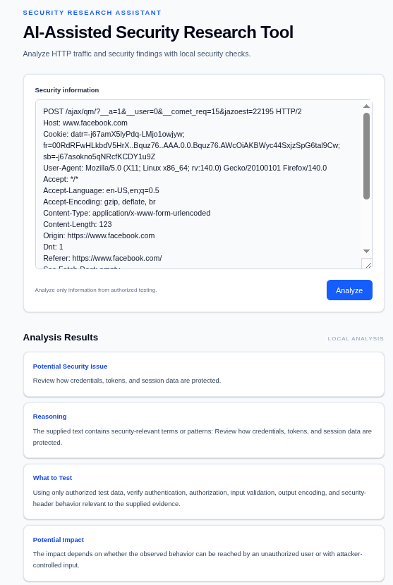
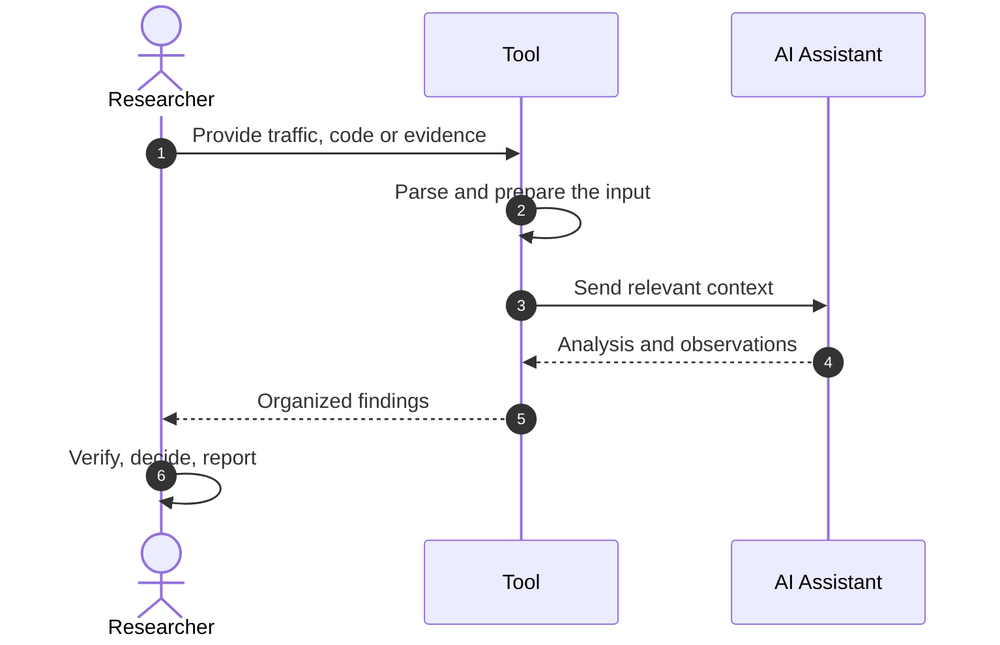

<p align="center">
  
</p>


```text
 ┌──────────────────────────────────────────────────────────────┐
 │  CASE FILE  ::  AI-ASSISTED SECURITY RESEARCH TOOL           │
 │  STATUS     ::  ACTIVE                                       │
 │  DOMAIN     ::  APPLICATION SECURITY                         │
 │  INPUTS     ::  HTTP TRAFFIC | SOURCE CODE | EVIDENCE        │
 │  ANALYST    ::  AHMED TAREK SALAH                            │
 └──────────────────────────────────────────────────────────────┘
```


> [!NOTE]
> A research assistant for application-security work. It helps analyze **HTTP traffic**, **source code** and **vulnerability evidence**, so the researcher can spend more time on judgment and less on repetitive review.

---

## `01` Mission

Application-security research produces a lot of raw material: captured requests and responses, unfamiliar codebases, and scattered notes about what a bug does. Reading all of it carefully takes hours.

This tool puts AI assistance and automation on that review work. It reads the material, surfaces what looks relevant and helps organize the evidence, while the researcher stays in control of what is real and what gets reported.

## `02` Capabilities

| Module | Input | What it helps with |
|:------:|:------|:-------------------|
|  **Traffic** | HTTP requests and responses | Reviewing captured traffic for interesting behavior and anomalies |
|  **Code** | Source code | Reading code for security-relevant patterns and issues |
|  **Evidence** | Findings and proof | Analyzing and organizing vulnerability evidence |
|  **Automation** | Repetitive review steps | Cutting down manual, repeated work |

<details>
<summary><b>Detailed capability list</b> (click to expand)</summary>

<br/>

- [ADD A SPECIFIC FEATURE]
- [ADD A SPECIFIC FEATURE]
- [ADD A SPECIFIC FEATURE]

</details>

## `03` Workflow



> [!IMPORTANT]
> AI output is a **lead, not a finding**. Every observation must be verified by the researcher before it is trusted or reported.

## `04` Quick start

```bash
git clone https://github.com/PYRAMID-SEC/AI-Assisted-Security-Research-Tool.git
cd AI-Assisted-Security-Research-Tool
[INSTALL COMMAND]
```

**Requirements**

- [LANGUAGE AND VERSION]
- [AI PROVIDER OR MODEL, AND HOW TO CONFIGURE IT]

**Run**

```bash
[RUN COMMAND]
```

> [!TIP]
> Keep API keys in environment variables or a git-ignored `.env` file. Never commit them.

## `05` Example

```text
[PASTE A REAL, SANITIZED EXAMPLE: INPUT, THEN OUTPUT]
```

📸 *Add a screenshot of the tool in action here. A real example is the strongest part of this README.*

## `06` Project layout

```text
[PASTE THE OUTPUT OF `tree -L 2` HERE]
```

## `07` Rules of engagement

> [!WARNING]
> Use this tool only on systems, applications and code you own or are **explicitly authorized** to test.

- **Authorization first.** Follow the scope and rules of any program or engagement you are part of.
- **Sanitize before sending.** Traffic and code can contain tokens, cookies, personal data and proprietary material. Remove or mask them before sharing anything with an external AI service.
- **Verify everything.** AI can be wrong or overconfident. Reproduce an issue yourself before reporting it.
- **Disclose responsibly.** Report vulnerabilities to the owner through the proper channel.


## `08` Operator

**Ahmed Tarek Salah**, Cybersecurity Researcher, building at [PYRAMID-SEC](https://github.com/PYRAMID-SEC).

[](https://www.linkedin.com/in/ahmed-t-756505379/)
[](https://hackerone.com/thaqib)
[](https://github.com/PYRAMID-SEC)


